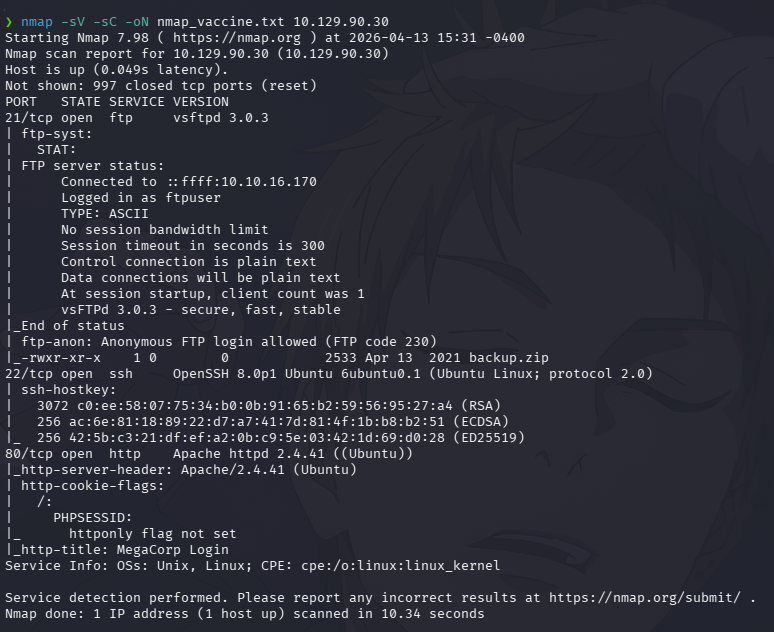
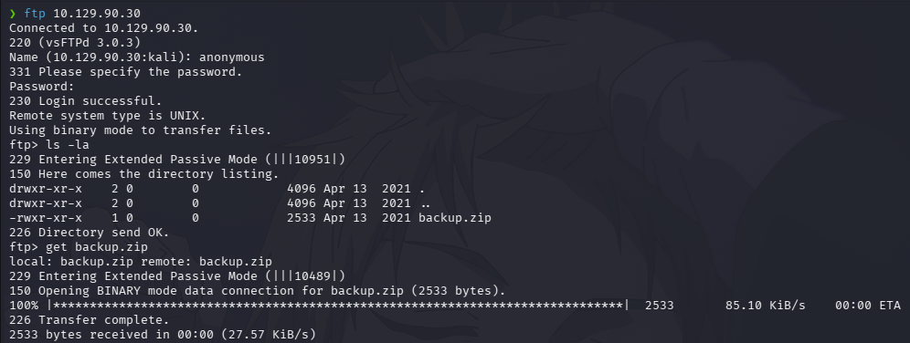

# HTB — Vaccine (Easy/Linux)


## Summary

Vaccine è una macchina Linux dove bisogna sfruttare una vulnerabilità SQL. La macchina è vulnerabile a SQLI (SQL Injection), permettendo l'accesso alla shell e al livello root. Durante il percorso si trovano due file php contenenti credenziali importanti protette tramite hash. Bisogna usare John the Ripper per oltrepassare il vincolo.

**Attack Chain:** FTP -> .ZIP -> SQL -> SHELL

---

## Reconnaissance

### Port Scan

```bash
nmap -sV -sC -oN nmap_vaccine.txt 10.129.90.30
```

**Results:**

PORT   STATE SERVICE VERSION
21/tcp open  ftp     vsftpd 3.0.3
22/tcp open  ssh     OpenSSH 8.0p1 Ubuntu
80/tcp open  http    Apache httpd 2.4.41



Tre porte aperte. Ho usato la porta 21 perchè permetteva l'accesso da 'anonymous' senza uso di password

---

## Enumeration

### FPT

Usando FPT, sono entrato grazie all'impostazione anonymous presente. Li, ho trovato una cartella 'backup.zip'.
- get backup.zip


